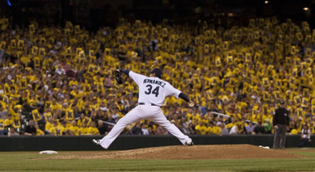

# Baseball Score Check

> [Baseball Score Check](https://www.amazon.com/gp/product/B075DL156N?ie=UTF8&ref-suffix=ss_rw) is your major league scorecard on Alexa! Tell Alexa to 'Open Baseball Score Check' then ask for any team and date back to the 2005 season. For instance, ask 'Alexa, check the Mariners score June 2 2016'. For help, say 'HELP'. For a complete team list, say 'TEAM LIST'.

Baseball Score Check is my first Alexa skill, completed in October 2017. It is built entirely in Python on the [flask-ask](https://github.com/johnwheeler/flask-ask) framework. I am grateful for the help and patience of John Wheeler and the community he has built around his extension. I am also indebted to the [mlbgame](https://github.com/panzarino/mlbgame) library, developed by [Zach Panzarino](http://panz.io/), that powers the skill's baseball gamestat retrieval.

This skill permits the user to retrieve the score and winning pitcher for any baseball game played, back to the 2005 season.

> * "Alexa, check the Mariners score yesterday"
> * "Alexa, check the Seattle Mariners score on August 15, 2012"
> * "Alexa, Mariners last week"

The user input is validated five times before the request is passed to mlbgame. In order:

> 1. If the user askes for the 'Diamondbacks', the skill converts the teamname to 'd-backs'
> 2. If the user did not give a date, the user is prompted for a date
> 3. If the user gave a nonsensical date, the user is prompted for a valid date
> 4. If the user game a nonsensical team, the user is prompted for a valid team or the team list
> 5. If the user requested a date < the 2005 season, the user is prompted for a date >= 2005

This skill and its codebase is available free of charge. If you'd like to feature or reuse any part of my code or skill (caveat emptor - I'm new to Python), please credit me and pay it forward by helping other Python developers grow the flask-ask community. - David Tobey
